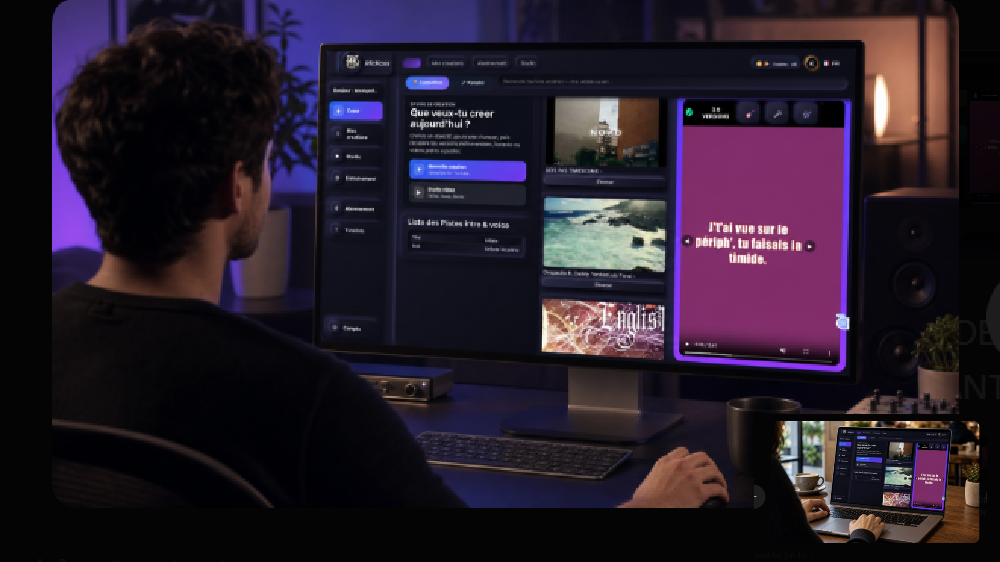

# MicKoss

**MicKoss** est une application web de création et de pratique du karaoké : à partir d'un simple fichier audio ou d'un lien YouTube, elle sépare la voix de l'instrumental, génère et synchronise les paroles, puis produit une vidéo karaoké prête à chanter.

> Ce dépôt est une **vitrine** du projet (captures d'écran, fonctionnalités, stack). Le code source est privé — accès sur demande pour les investisseurs, partenaires ou recruteurs intéressés.

## Liens de vérification

  
  
  

<em><a href="liens-acces-verification.pdf">Version PDF</a></em>

---

## Aperçu

*MicKoss utilisé en studio comme sur mobile.*

*Création d'un karaoké : import, recherche YouTube et suivi des versions générées.*

*Paroles en vedette, chansons en compétition et bibliothèque des créations récentes.*

*Génération des paroles synchronisées puis lecture karaoké en mode "chanter".*

*Habillage vidéo automatique en plusieurs styles, prêt pour les réseaux sociaux.*

*Deux utilisateurs s'affrontent sur le même morceau en mode compétition.*

*Offres Free, Pro, Max et B2B.*

---

## Fonctionnalités

- **Import multi-source** — fichier local (audio/vidéo) ou recherche/import YouTube.
- **Séparation audio** — isolation voix / instrumental par IA.
- **Génération de paroles** — transcription et synchronisation automatique sur la piste audio.
- **Génération vidéo karaoké** — rendu vidéo avec paroles animées et fond personnalisable.
- **Lecteur interactif** — lecture karaoké avec suivi en temps réel des paroles.
- **Mode compétition** — scoring et classement entre utilisateurs.
- **Comptes utilisateurs** — authentification, crédits, paiements.
- **Bibliothèque personnelle** — historique et gestion des morceaux traités.
- **Traitement multi-utilisateurs en parallèle** — plusieurs utilisateurs peuvent traiter leurs fichiers simultanément.

## Stack technique

| Composant | Technologies |
| --- | --- |
| Backend | Python, FastAPI |
| Frontend | React, Vite |
| Base de données | PostgreSQL |
| Traitement asynchrone | Celery, Redis |
| Infrastructure | Docker, Nginx, Hetzner |
| Stockage objet | Cloudflare R2 (compatible S3) |
| Supervision | Prometheus, Grafana |

## À propos de ce dépôt

Ce dépôt ne contient **aucun code source**. Il sert uniquement à présenter le projet : fonctionnalités, captures d'écran et documentation de haut niveau, à destination des investisseurs, partenaires et recruteurs.

Pour une démonstration en direct ou un accès au code sous NDA, merci de me contacter directement.

---

© MicKoss — Tous droits réservés.
