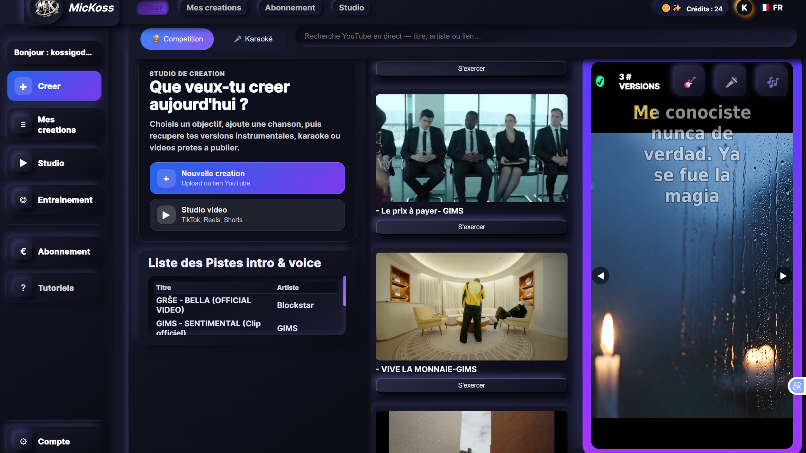
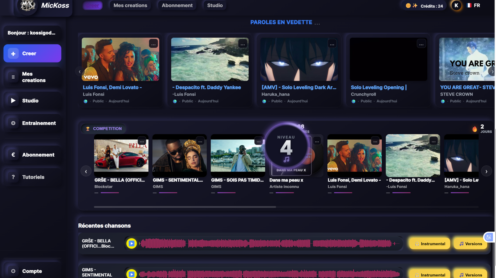
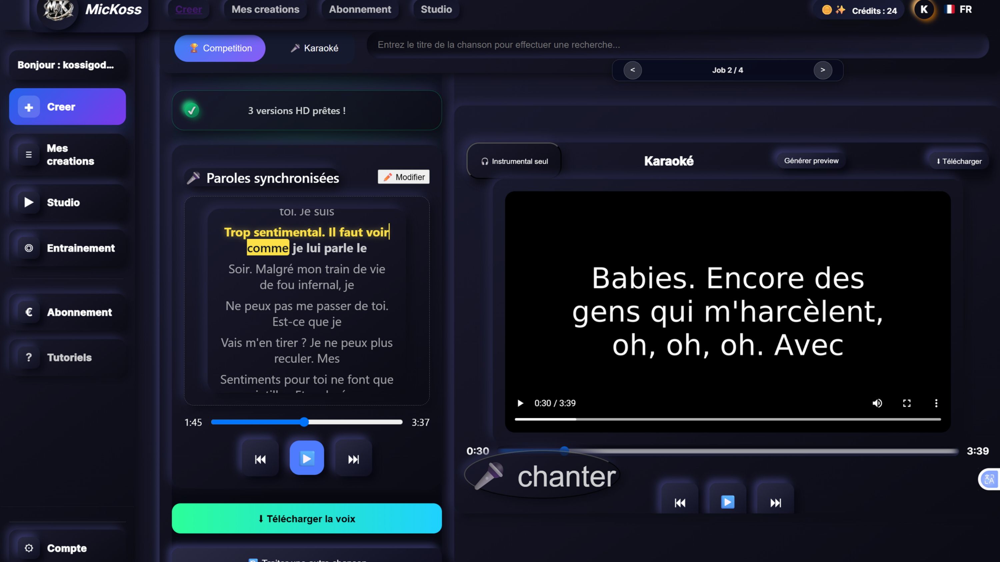
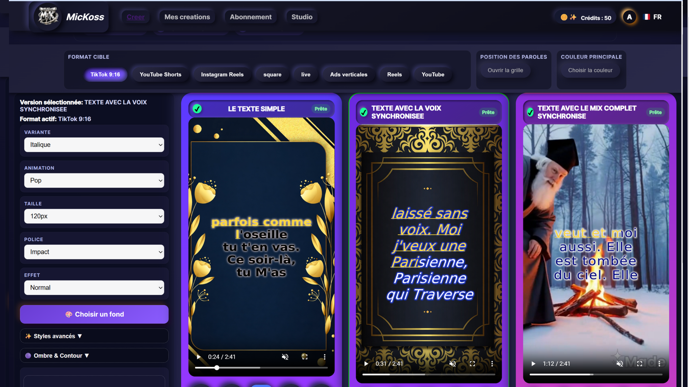
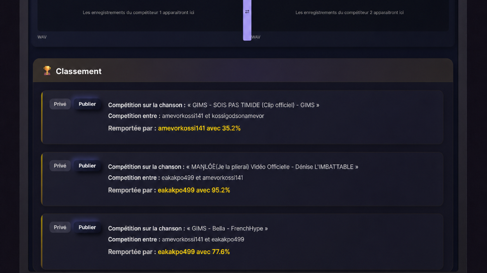
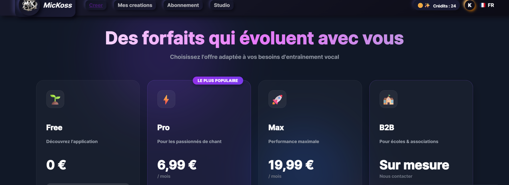
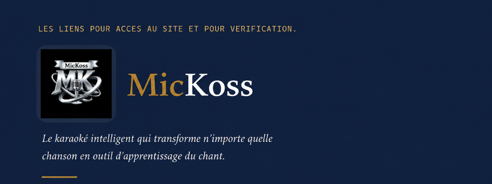
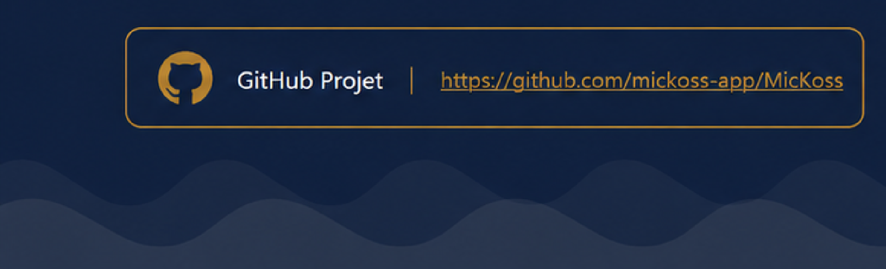
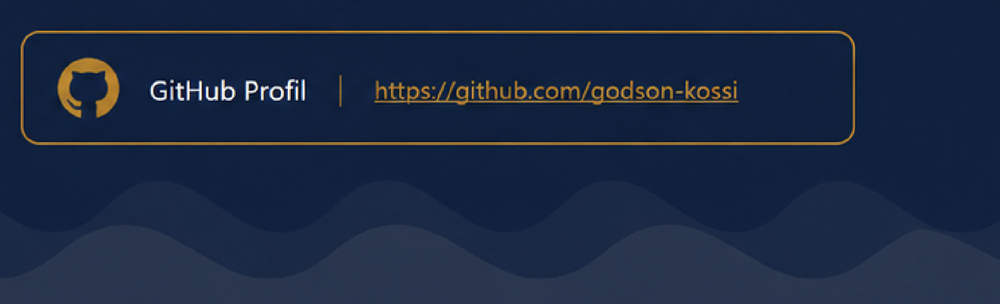

<h1 align="center">MicKoss</h1>

<em>Le karaoké intelligent qui transforme n'importe quelle chanson en outil d'apprentissage du chant.</em>

  
  
  

  
  
  
  
  

---

> **Ce dépôt est une vitrine du projet.** Il ne contient aucun code source : uniquement une présentation, des captures d'écran et de la documentation, à destination des investisseurs, partenaires et recruteurs. Le code (`MicKoss-Source`) reste privé — accès sur demande, sous NDA si nécessaire.

## Sommaire

- [Le problème, la solution](#le-problème-la-solution)
- [Fonctionnalités](#fonctionnalités)
- [Aperçu de l'application](#aperçu-de-lapplication)
- [Stack technique](#stack-technique)
- [Vérification & accès](#vérification--accès)
- [À propos de ce dépôt](#à-propos-de-ce-dépôt)

## Le problème, la solution

Les outils de karaoké existants forcent un choix : **Smule** mise tout sur le divertissement social avec un catalogue sous licence, sans jamais faire progresser la voix de l'utilisateur ; **Yousician** enferme l'apprentissage vocal structuré dans un catalogue d'exercices fermé, loin des chansons que les gens veulent réellement chanter.

**MicKoss** réunit les deux mondes : à partir d'un simple fichier audio ou d'un lien YouTube — n'importe lequel — la plateforme sépare automatiquement la voix de l'instrumental par IA, synchronise les paroles mot à mot, puis ouvre trois usages sur ce même morceau : le karaoké vidéo, l'entraînement vocal structuré, et la compétition entre utilisateurs.

## Fonctionnalités

**Créer**
- Import multi-source — fichier local (audio/vidéo) ou recherche/import YouTube direct.
- Séparation vocale / instrumentale par intelligence artificielle.
- Transcription et synchronisation automatique des paroles, mot à mot.
- Génération de vidéos karaoké avec fond personnalisable.

**S'entraîner**
- Trois modes dédiés : apprentissage guidé, répétition, modulation vocale.
- Lecteur interactif avec suivi en temps réel des paroles.
- Bibliothèque personnelle — historique et progression conservés.

**Rivaliser & partager**
- Mode compétition : défi entre utilisateurs sur un même morceau, enregistrement et classement.
- Comptes utilisateurs, système de crédits et abonnements (Stripe).
- Traitement asynchrone multi-utilisateurs — plusieurs personnes traitent leurs fichiers en parallèle sans se bloquer.

## Aperçu de l'application

### Créer un karaoké

L'utilisateur importe un fichier ou colle un lien YouTube ; la plateforme prend le relais pour la séparation audio et le suivi de traitement, en temps réel.

### Bibliothèque et découverte

Paroles en vedette, chansons proposées en compétition et créations récentes : un point d'entrée unique vers tout ce que l'utilisateur (et la communauté) a déjà généré.

### Paroles synchronisées & lecture karaoké

Le cœur technique du produit : une synchronisation mot à mot précise, y compris sur les morceaux avec une longue intro instrumentale — un cas qui met en échec la plupart des outils grand public.

### Habillage vidéo automatique

Chaque session peut être exportée en vidéo, dans plusieurs styles visuels générés automatiquement — prête à partager sur les réseaux sociaux.

### Mode compétition

Deux utilisateurs s'affrontent sur le même morceau : la mécanique sociale qui manque aux outils d'apprentissage purs, empruntée aux jeux de rythme et à la gamification façon Duolingo.

### Un modèle freemium pensé pour la rétention

Seule la création d'un nouveau contenu consomme des crédits — l'entraînement et la compétition sur du contenu déjà généré restent gratuits à vie, y compris pour un compte à 0 crédit.

## Stack technique

| Composant | Technologies |
| --- | --- |
| Backend | Python, FastAPI |
| Frontend | React, Vite |
| Base de données | PostgreSQL |
| Traitement asynchrone | Celery, Redis |
| Infrastructure | Docker, Nginx, Hetzner |
| Stockage objet | Cloudflare R2 (compatible S3) |
| Supervision | Prometheus, Grafana |

## Vérification & accès

Version PDF du document de vérification

<a href="liens-acces-verification.pdf">liens-acces-verification.pdf</a>

## À propos de ce dépôt

Ce dépôt ne contient **aucun code source**. Il sert uniquement à présenter le projet — fonctionnalités, captures d'écran et documentation de haut niveau — à destination des investisseurs, partenaires et recruteurs.

Pour une démonstration en direct ou un accès au code sous NDA, merci de me contacter directement via mon [profil GitHub](https://github.com/godson-kossi).

---

© MicKoss — Tous droits réservés.

